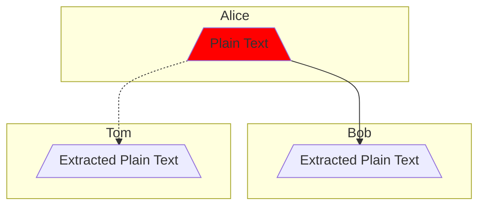
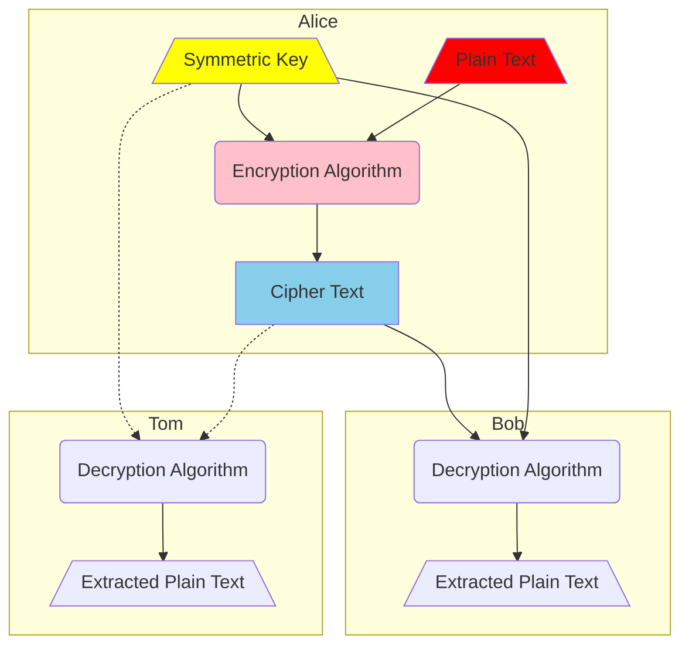
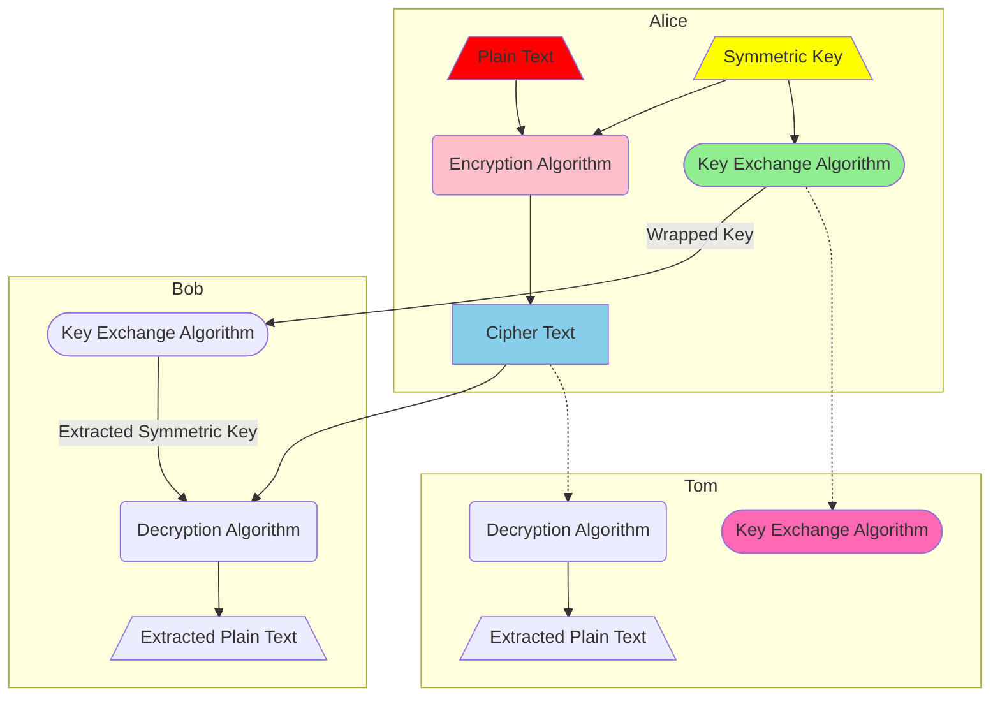
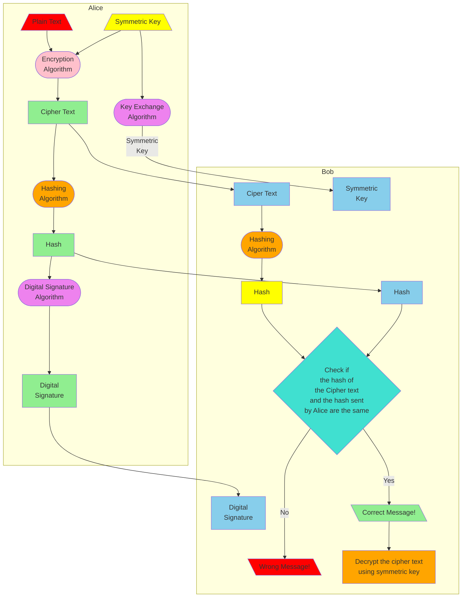

# Cryptography for Kids 

## Introduction

A couple of years back, me and my friends wanted to plan about our gifts for our other friend, Advika's birthday. We wanted to communicate in secret so that Advika wouldn't know about our plans.That day I asked my father ([Sunny Gupta]( https://www.linkedin.com/in/sunnygupta1)), what we could do and he told me about cryptography and then me and my friends used the shift code to talk about it.This code involves encrypting the message using a key. The key is a number, for example if the key is 3 then, A will become X.Then I started learning more about cryptography, I explored many topics like Post Quantum Cryptoghraphy, [Diffie-Hellman](https://www.bing.com/videos/riverview/relatedvideo?&q=diffie+hellman&adlt=strict&mid=9C33D774D1A6FBE6CC9D9C33D774D1A6FBE6CC9D&&FORM=VRDGAR), [Digital Certificate](https://www.bing.com/videos/riverview/relatedvideo?&q=digital+certificate&adlt=strict&mid=8030B3595712EB787C998030B3595712EB787C99&&FORM=GVRPTV), [Digital Signature](https://www.bing.com/videos/riverview/relatedvideo?&q=digital+signature&adlt=strict&mid=1FA30248B1778AA313EF1FA30248B1778AA313EF&&FORM=VRDGAR),RSA and more.

TODO: Explain how A becomes X when shift key = 3. Give another example to clarify (add one more column)
 
Below is the shift code for shift key, **k = -3** and **k = 4**

| Plain Character | Cipher Character (k = -3) | Cipher Character (k = 4) |
| --- | --- | --- |
| A | X | E |
| B | Y |
| C | Z | 
| D | A |
| E | B |
| I | F |
| J | G |
| K | H |
| L | I |
| M | J | 
| Q | N |
| R | O |
| S | P |
| T | Q |
| U | R |
| V | S |
| W | T |
| X | U |
| Y | V |
| Z | W |

## What's wrong if Alice sends only plain text?

If Alice sends only the plain text, it can not be a
secret message because everyone including Tom can see it.

That is why Alice generates a symmetric key. She encrypts the message using the symmetric key and send it to Bob along with the key. Then Bob will decrypt it using Alice's symmetric key.

### What's wrong if Alice sends only the encrypted plain text ?

If Alice sends only the plain text encrypted with the symmetric key, Tom can stop the message and decrypt it using the key.

To stop this Alice uses a key exchange algorithm, which is exchanging the key, in this case from Alice to Bob.

### What's wrong if we exchange the key?

If Alice exchanges the key Tom could exchange the key with Alice and every message tht Alice sends will be seen by Tom.Then Tom might exchange his own key with Bob and send his own messages to him.

To stop this Alice can sign the cipher text with her digital signature and send it to Bob.Bob will then verify the digital signature and see if the message came from Alice or not.

## Complete Flow Diagram

In the diagram above Alice wants secret messages to Bob, but they don't want Tom (who wants to interfare with the secret messages) to get his hands on the message.
