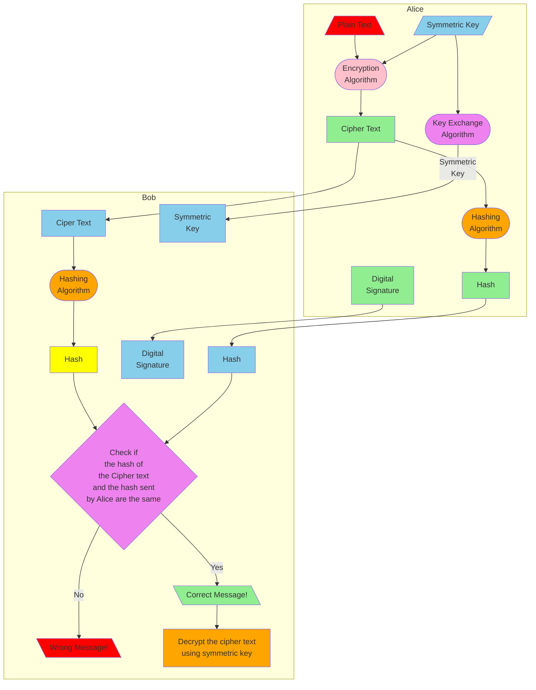

# Cryptography for Kids

Refer to [Digital Certificate](https://www.bing.com/videos/riverview/relatedvideo?&q=digital+certificate&adlt=strict&mid=8030B3595712EB787C998030B3595712EB787C99&&FORM=GVRPTV)

## Introduction

A few years back, me and my friends wanted to plan about our gifts for our other friend, Advika's birthday. We wanted to communicate in secret so that Advika wouldn't know about our plans.That day I asked my father what we could do and he told me about cryptography and then me and my friends used the shift code to talk about it.This code involves encrypting the message using a key. The key is a number, for example if the key is 3 then, A will become X.Then I started learning more about cryptography I explored many topics like Post Quantum Cryptoghraphy, [Diffie-Hellman](https://www.bing.com/videos/riverview/relatedvideo?&q=diffie+hellman&adlt=strict&mid=9C33D774D1A6FBE6CC9D9C33D774D1A6FBE6CC9D&&FORM=VRDGAR),RSA and more.
 
**Below is the shift for shift 3**

| Plain Character | Cipher Character |
| --- | --- |
| A | X |
| B | Y |
| C | Z | 
| D | A |
| E | B |
| I | F |
| J | G |
| K | H |
| L | I |
| M | J | 
| Q | N |
| R | O |
| S | P |
| T | Q |
| U | R |
| V | S |
| W | T |
| X | U |
| Y | V |
| Z | W |

