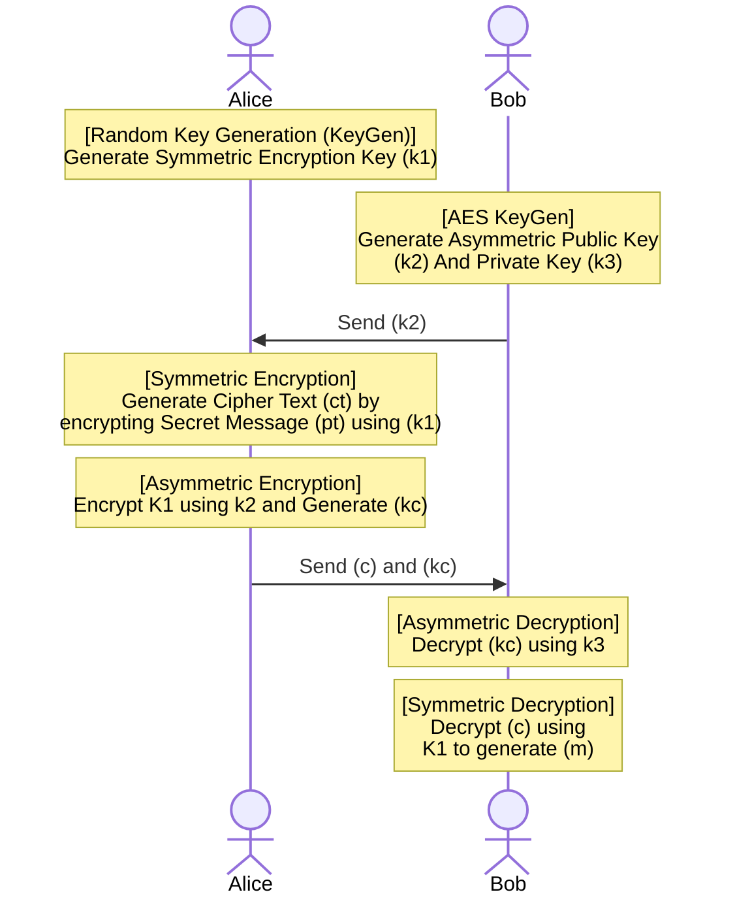

# Introduction

# Sequence Diagram

```mermaid
    sequenceDiagram
    actor Alice
    actor Bob

    note over Alice: [Random Key Generation (KeyGen)] <br/> Generate Symmetric Encryption Key (k1)
    note over Bob: [AES KeyGen] <br/> Generate Asymmetric Public Key <br/> (k2) And Private Key (k3)
    Bob->>Alice: Send (k2)
    note over Alice: [Symmetric Encryption] <br/> Generate Cipher Text (ct) by <br/> encrypting Secret Message (pt) using (k1)
    note over Alice: [Asymmetric Encryption] <br/> Encrypt K1 using k2 and Generate (kc)
    Alice->>Bob: Send (c) and (kc)
    note over Bob: [Asymmetric Decryption] <br/> Decrypt (kc) using k3
    note over Bob:  [Symmetric Decryption] <br/> Decrypt (c) using <br/> K1 to generate (m)
```